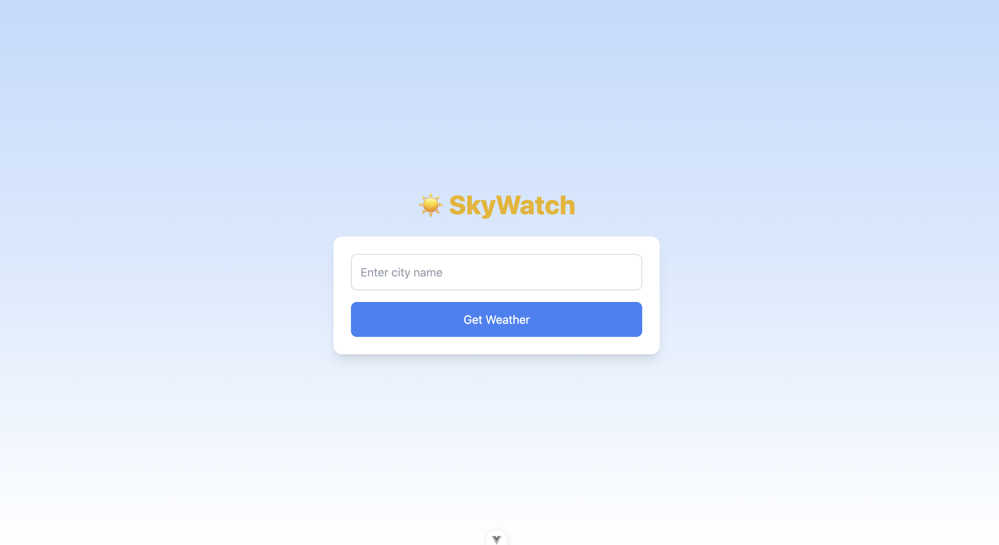
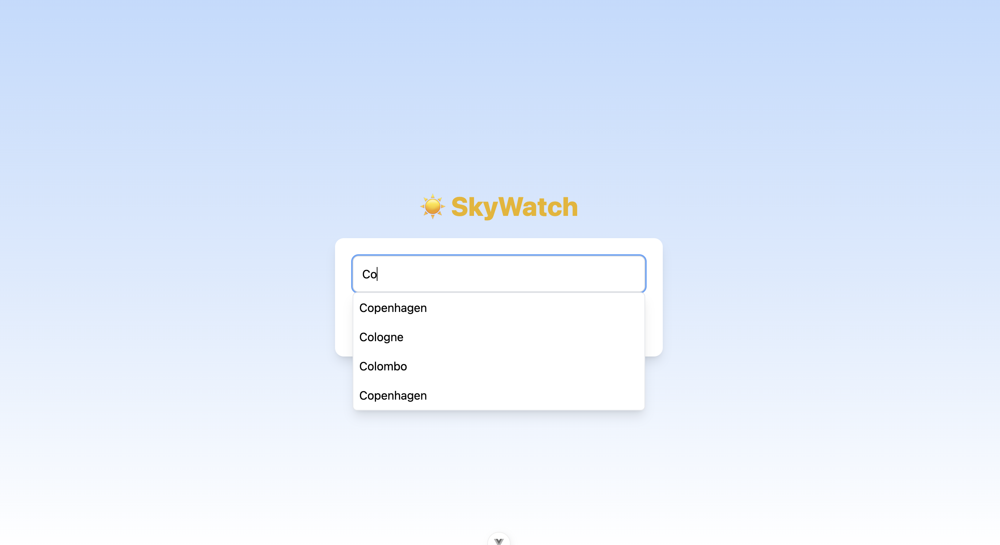
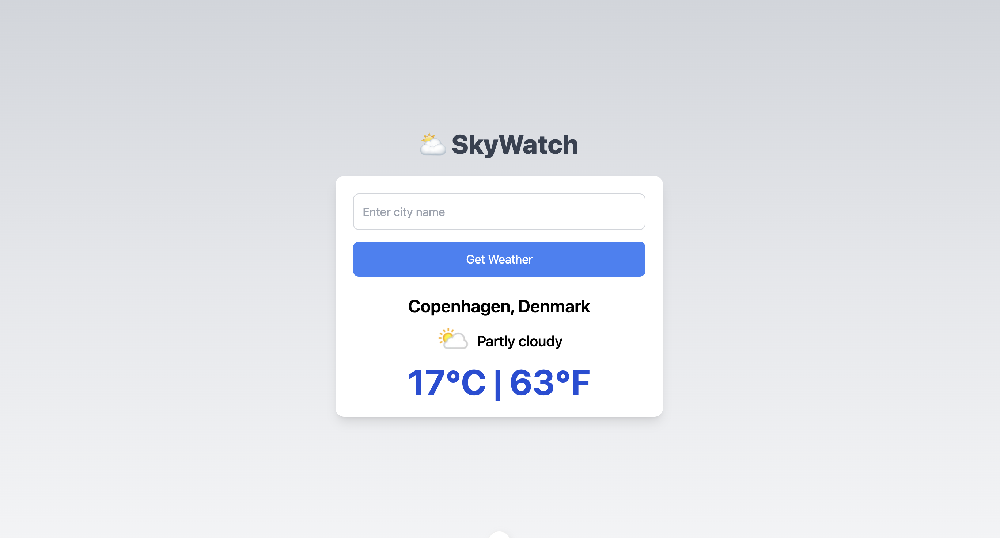

# 🌤️ Vue Weather App

A sleek and responsive weather application built with **Vue 3**, styled using **TailwindCSS**, and tested with **Playwright**.It has dynamic changes for icons and background color according to weather showing both in Centigrade(°C) and Fahrenheit(°F)  This project also includes a GitHub Actions CI/CD workflow to run end-to-end tests on every push and pull request to the `main` branch.

---

## 🚀 Features

- 🔍 Get current weather data using **Axios**
- ⚡ Fast development with **Vite**
- 🎨 Beautiful UI powered by **TailwindCSS**
- ✅ End-to-end testing with **Playwright**
- 🔁 Continuous integration using **GitHub Actions**

---

## ♿ Accessibility

This project has been built with accessibility in mind. Some of the key accessibility features include:

- 🎛 **ARIA roles and attributes**
  - `role="combobox"` on the search input for screen readers
  - `aria-expanded`, `aria-autocomplete`, and `aria-controls` to describe input state
  - `role="listbox"` and `role="option"` for city suggestions
  - `role="alert"` for error messages so they are announced immediately
  - `role="region"` and `aria-live="polite"` for weather results to announce updates

- ⌨️ **Keyboard support**
  - Users can navigate suggestions with the keyboard and press **Enter** to select
  - Pressing **Enter** on the input fetches weather for the selected city

- 🎨 **Color contrast**
  - Ensured sufficient contrast between text and background for readability

These improvements make the app usable with screen readers and keyboard navigation, ensuring a more inclusive experience.

---

## 🛠️ Tech Stack

- [Vue 3](https://vuejs.org/)
- [Vite](https://vitejs.dev/)
- [TailwindCSS](https://tailwindcss.com/)
- [Axios](https://axios-http.com/)
- [Playwright](https://playwright.dev/)
- [GitHub Actions](https://github.com/features/actions)

---

# 🌦️ Vue Weather App

A simple weather application built with Vue.

## 📸 Screenshots

### Home Page


### Search Suggestions


### Forecast View


---

## 🔗 Live Links

- 🚀 **Storybook (Live Preview on Netlify)**: [https://vueweatherapp-mu.vercel.app/](https://vueweatherapp-mu.vercel.app/)
- 💻 **GitHub Repository**: [https://github.com/kumarith/vue-weather-app](https://github.com/kumarith/vue-weather-app)

---

## 📦 Installation & Local Setup

```bash
# 1. Clone the repository
git clone https://github.com/kumarith/vue-weather-app
cd weather

# 2. Install dependencies
npm install

# 3. Run the dev server
npm run dev

# 4. Build for production
npm run build

# 5. Preview production build
npm run preview

- App will be available at http://localhost:5173 by default.

---

## Playwright E2E

# Install Playwright dependencies and browsers
npx playwright install --with-deps

# Run tests
npm run test:e2e

# View tedts report
npx playwright show-report

---

## GithubActions CI Workflow 

- This project includes a CI pipeline that:
- Runs on push and pull_request to the main branch
- Installs Node.js and project dependencies
- Runs Playwright E2E tests
- Uploads Playwright test reports


